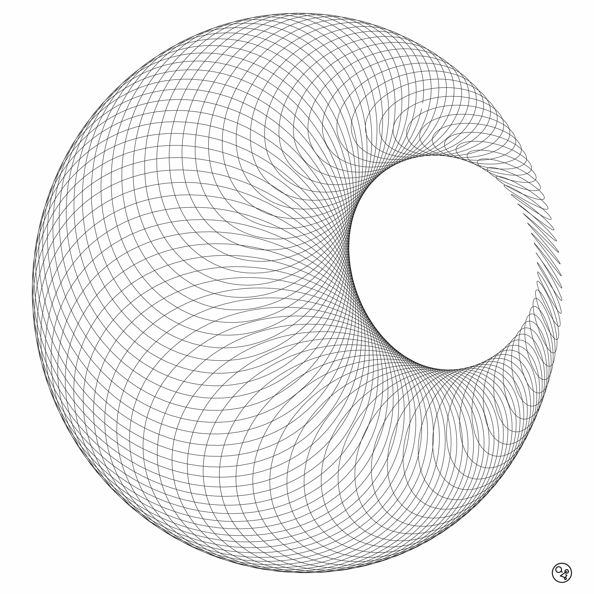
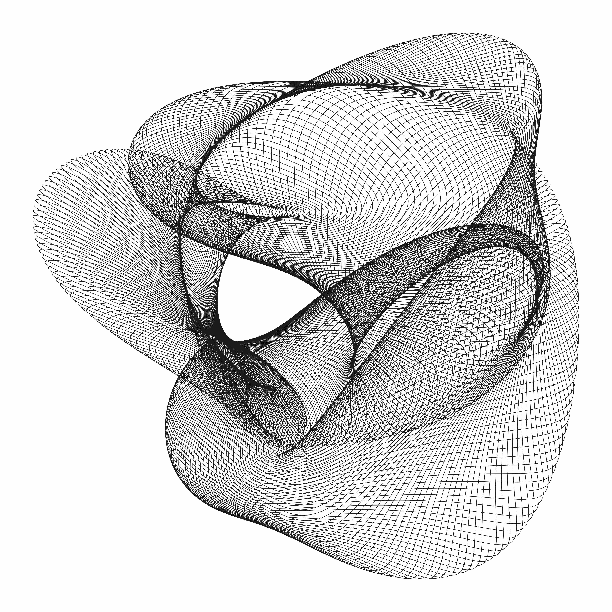
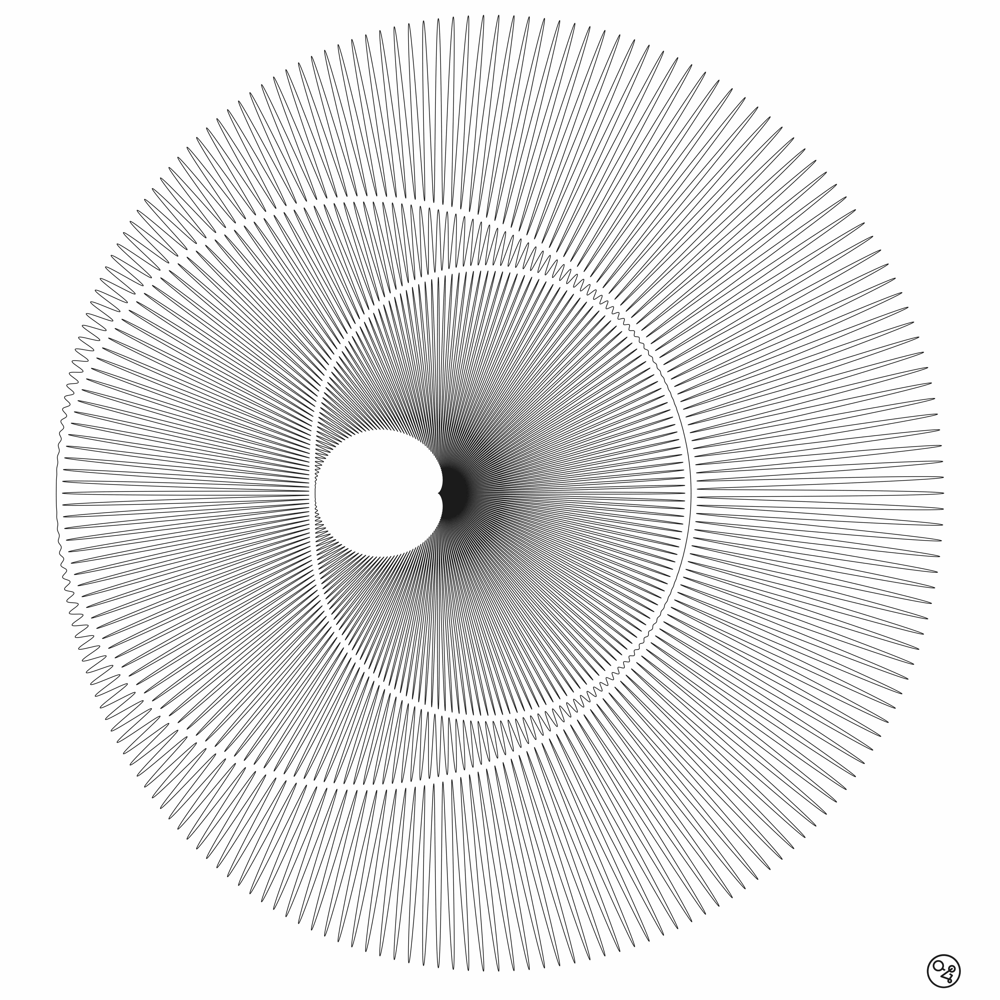
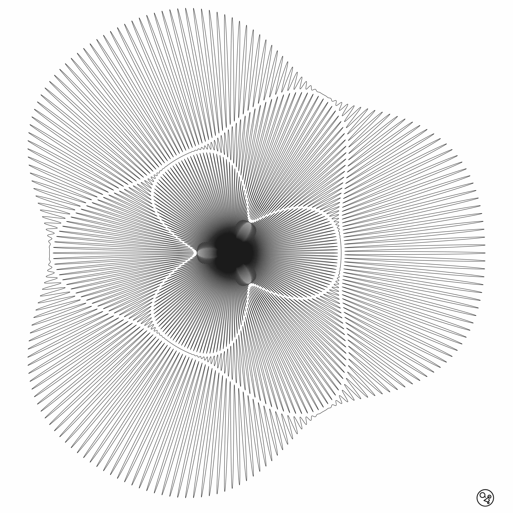

# Differential Forms
This is a pintograph simulator wrote by Gianmarco Cracco & Andrea Borghi. Our [Instagram profile](https://instagram.com/differentialforms?igshid=YmMyMTA2M2Y=).

<p align="center">
  
</p>

## Resources
A few links to understand what a pintograph is:
* [Fran McConville's Harmonograph Page](http://www.fxmtech.com/harmonog.html)
* [James Nolan Gandy's blog](https://www.jamesnolangandy.com)
* [James Nolan Gandy's Intagram profile](https://www.google.com/url?sa=t&rct=j&q=&esrc=s&source=web&cd=&cad=rja&uact=8&ved=2ahUKEwinrMXjnqf9AhVI2aQKHfzvADcQFnoECA4QAQ&url=https%3A%2F%2Fwww.instagram.com%2Fgandyworks%2F&usg=AOvVaw3hkotr0q_3q5Qa1ZrvxRZJ)


## Getting started
*tested with Python 3.9 on MacOS 12.4 and Windows 10*

Clone the repo in your desired path:
```bash
git clone https://github.com/gianmarcocr/Differential-Forms.git
```

Move to your directory and set up a virtual env:
```bash
pip install poetry
poetry config virtualenvs.in-project true (optional)
poetry install
```
You're good to go! Play with the code & parameters either with `main.py` or `Differential_Forms.ipynb`. An alpha version of interactive Jupyter notebook can be found in `Differential_Forms_interactive.ipynb`.

### Some images

|              Example 1              |              Example 2              |
|:-----------------------------------:|:-----------------------------------:|
|  |  |

|              Example 3              |              Example 4              |
|:-----------------------------------:|:-----------------------------------:|
|  |  |

## Coming soon
* better documentations
* more examples
* project page on [GitHub Pages](https://pages.github.com)
* add color palette
