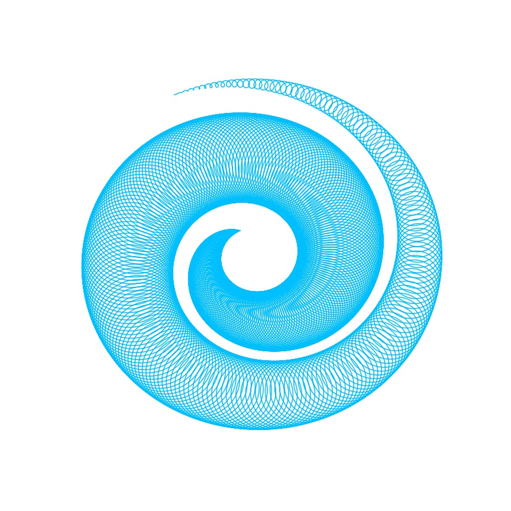
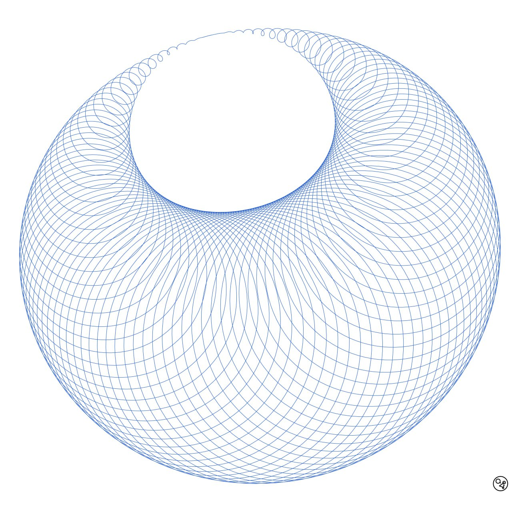
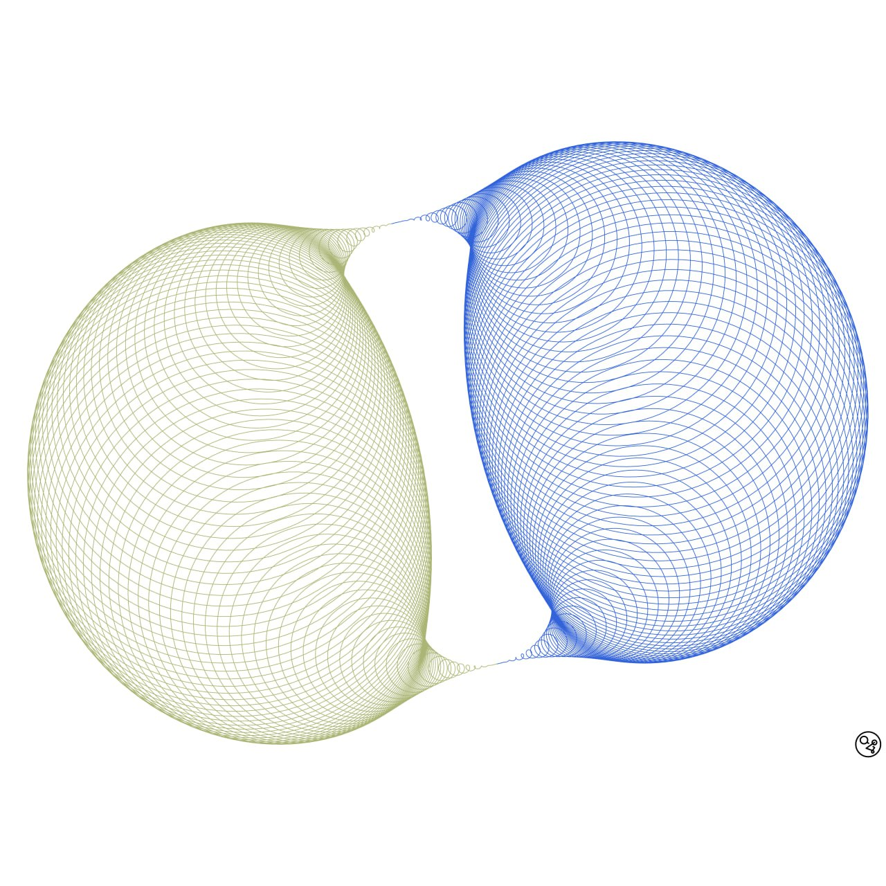

# Differential Forms

Made by Gianmarco Cracco & Andrea Borghi. Our [Instagram](https://instagram.com/differentialforms?igshid=YmMyMTA2M2Y=).

<p align="center">
  
</p>

[//]: # ()
### Setup
* Python 3.9

### Getting started
Clone the repo in your desired path:
```bash
git clone https://github.com/gianmarcocr/Differential-Forms.git
```

Move to your directory and setup a virtual env:
```bash
python -m venv venv
source venv/bin/activate
pip install -r requirements.txt
```

### Some images


